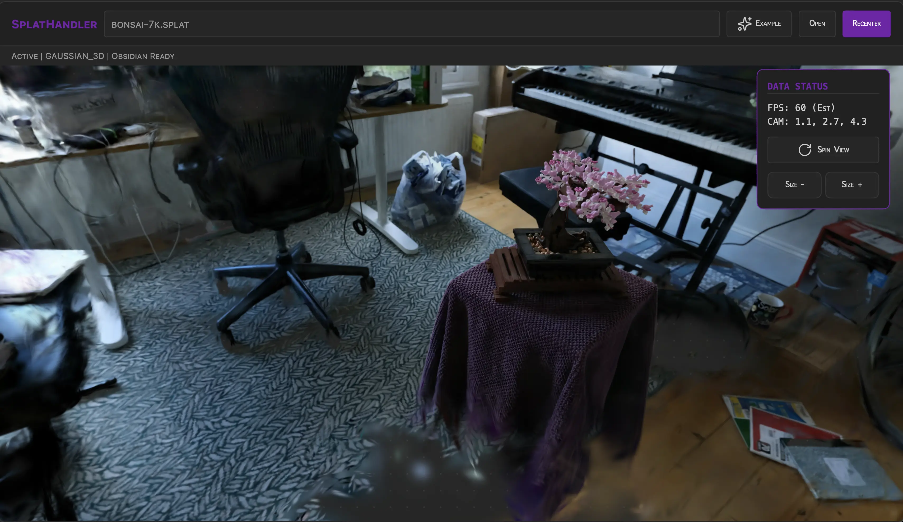

  
  
  <h1 align="center">SPLAT HANDLER</h1>
  <h3 align="center"> Gaussian Splat 3D Scene Viewer </h3>

  <!-- TOP PURPLE LINKS -->
  
  
  
   
  <!-- BOTTOM GOLD TAXONOMY -->
  
  
  
  

  

    <i> A high-performance 3D scene visualizer built for rendering Gaussian Splatting files natively inside Obsidian. </i>
  

  

Welcome to **Splat Handler**, a high-performance 3D rendering component that allows you to drag-and-drop and interactively inspect `.ply` and `.splat` Gaussian Splat models directly within your Datacore workspace. 

---

## ✨ Features

### 🧊 Immersive 3D Rendering
* 🚀 **Gaussian Splatting**: Renders high-fidelity, complex 3D scenes in real time using `@mkkellogg/gaussian-splats-3d` and Three.js.
* 🖱 **Orbit Controls**: Rotate, zoom, and pan around the scene with smooth mouse or trackpad gestures.
* 📏 **Scale & Recenter Controls**: Dynamically scale splat size up and down and auto-recenter the camera viewport to fit the model boundaries.

### 🌐 Smart Asset Handling
* 📥 **Drag & Drop**: Effortlessly drag a local `.ply` or `.splat` file from your computer and drop it directly onto the viewport to load it instantly.
* 🔄 **Auto-Rotate**: Toggle automatic viewport spin to showcase the scene dynamically.
* 📦 **Dynamic Engine Loading**: Lazily resolves external Three.js and Gaussian Splat rendering libraries on demand to keep the load footprint minimal.

---

## 🛠 Troubleshooting

* **RangeError during load**: If you encounter a `RangeError: Offset is outside the bounds of the DataView`, check the browser console. The component now logs "SplatHandler: PLY Header Analysis" which displays the PLY header. Ensure the format is `binary_little_endian 1.0` and that `scale_0`, `rot_0` properties are present. ASCII PLY files are not supported.

---

## 📦 Directory Index & Components

The package exposes the following compiled files:

| File | Description |
| :--- | :--- |
| **[`SPLAT HANDLER.md`](SPLAT%20HANDLER.md)** | The main entry point leaf designed to be loaded inside Obsidian panes. |
| **[`example/EXAMPLE.md`](example/EXAMPLE.md)** | Standard example note preconfigured to load a sample model automatically. |
| **[`src/index.jsx`](src/index.jsx)** | Main application code managing initialization, drag-and-drop, and UI layout. |
| **[`METADATA.md`](METADATA.md)** | Packaging manifest outlining indexing, target, and security configurations. |
| **[`CONTRIBUTION.md`](CONTRIBUTION.md)** | Contributor architecture standards and local development guidelines. |
| **[`LICENSE.md`](LICENSE.md)** | MIT open-source license. |
